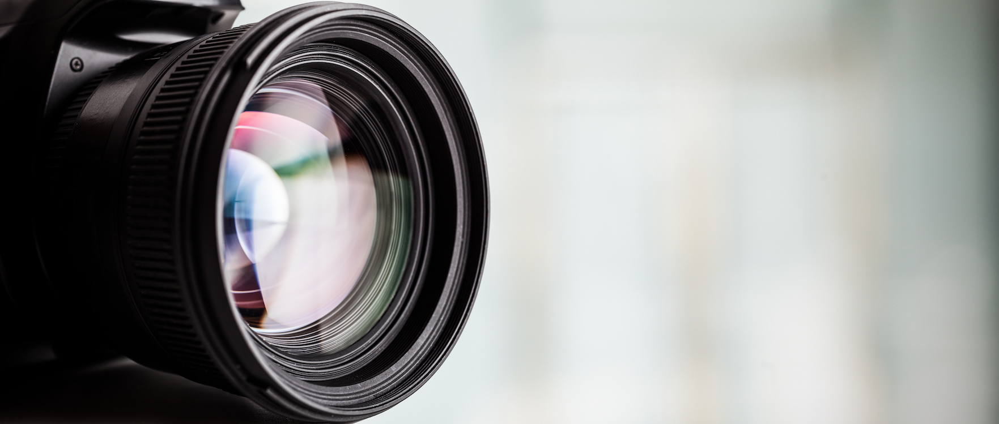

## Aim of this session

To learn about the photogrammetry technique to create 3D models.

The lesson presents basic background on this technique,
as well as practical exercises to acquire a
dataset for photogrammetry.

## Learning outcome(s)

By the end of this lessons learners will be able to:

## Prerequisite knowledge level

Basic literacy on:

- Digital photography
- Image processing
- Dealing with large amounts of files 

## Targeted expertise level

Basic to medium expertise on digital photography and handling information in PCs.

## CITATION

If you would like to CITE this material, please access: 

# Photogrammetry 3D Digitisation 

{alt="3D media"}
